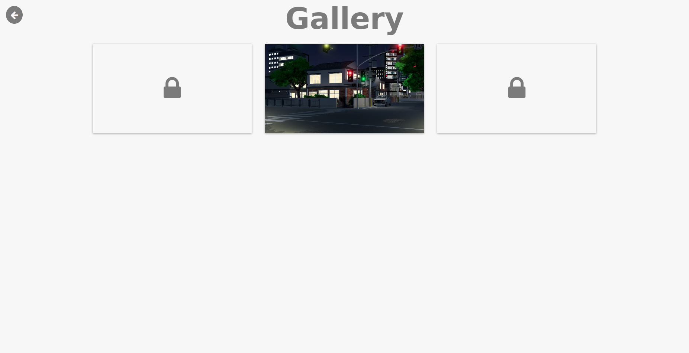

# Gallery



This component adds an image gallery to your game. With it, you may define the set of images you want to include and then lock or unlock them through the game!

This component is compatible with Monogatari **v1.4.1**

## Features
* Self-Contained: It works by adding just one file to your game!
* Responsive: The image gallery looks just fine in
* Localization: The gallery's text gets localized correctly
* Persistence: The list of unlocked images gets saved into the players global storage (it doesn't depend on a save slot)

## How to use it

* Add the `gallery.js` file to the `js` directory of your Monogatari game.
* Create a `gallery` directory inside the `img` directory, this is where you'll save the images you want to show in the gallery.
* Load the script (`gallery.js`) in your `index.html` file by adding the following line in your `<head>`, just before the one that loads the `main.js` one:

```html
<script src="js/gallery.js"></script>
```

* Add the following styles to your `main.css` file:

```css
[data-menu='gallery'] [data-ui='gallery'] figure {
	min-height: 10em;
	background-position: center;
	display: flex;
	align-items: center;
	justify-content: center;
	cursor: pointer;
	background-size: cover;
}

[data-menu='gallery'] [data-ui='gallery'] .fa {
	font-size: 3em;
}

[data-menu='gallery'] [data-ui='image-viewer'] figure {
	background-color: transparent;
	background-size: contain;
	background-repeat: no-repeat;
	height: 80%;
	width: 80%;
	margin: 0;
	overflow: hidden;
	background-position: center;
}

[data-menu='gallery'] [data-ui='image-viewer'] figure [data-action='close'] {
	position: absolute;
	right: 0;
	top: 0;
	width: 2em;
	height: 2em;
	margin: 0;
}
```

* Finally, open the `gallery.js` file, look for the `constructor ()` function. Inside it, you'll find a variable called `this.images`, this is where you should declare the images that will be shown in the gallery. Just like any other asset object in Monogatari, this variable expects a key-value for every image, where key is the name of the image and the value is the filename, here's an example:

```javascript
this.images = {
	"street": "street.jpg",
	"home": "home_night.png",
	"bus": "bus_stop_night.jpg"
};
```

Remember all those images must be saved inside the `gallery` directory!

### How to unlock an image?
Here's a simple script showing how can an image be locked or unlocked. It's using Monogatari's reversible functions so that the images gets locked again if the player goes back.
In this example we'll use the `home` image declared in the sample we provided above for the `this.images` variable of the gallery.

```javascript
let script = {
	// The game starts here.
	"Start": [
		"Welcome! Let's see how the gallery works! If you haven;t checked it out, open it from the quick menu!",
		{"Function":{
			"Apply": function () {
				ImageGallery.unlock ("home");
				return true;
			},

			"Reverse": function () {
				ImageGallery.lock ("home");
			}
		}},
		"And that was it!",
		"end"
	]
};
```

## License
This component is released under the [MIT license]('./LICENSE.md').
